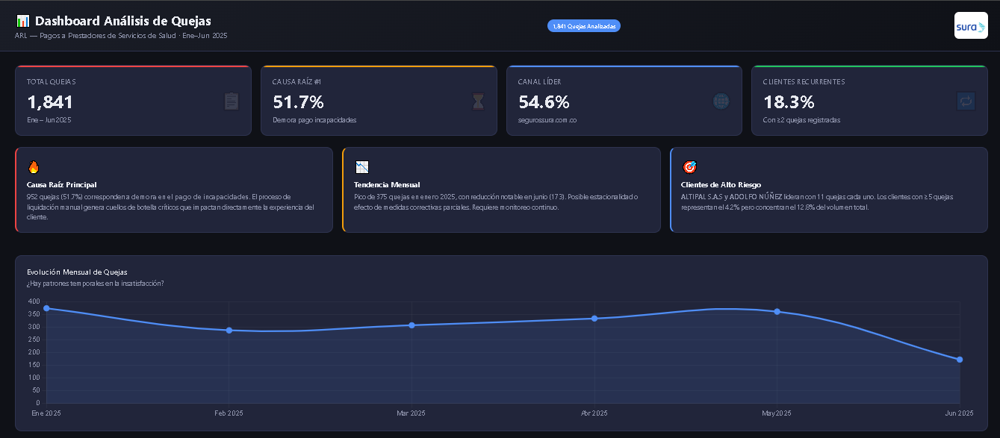
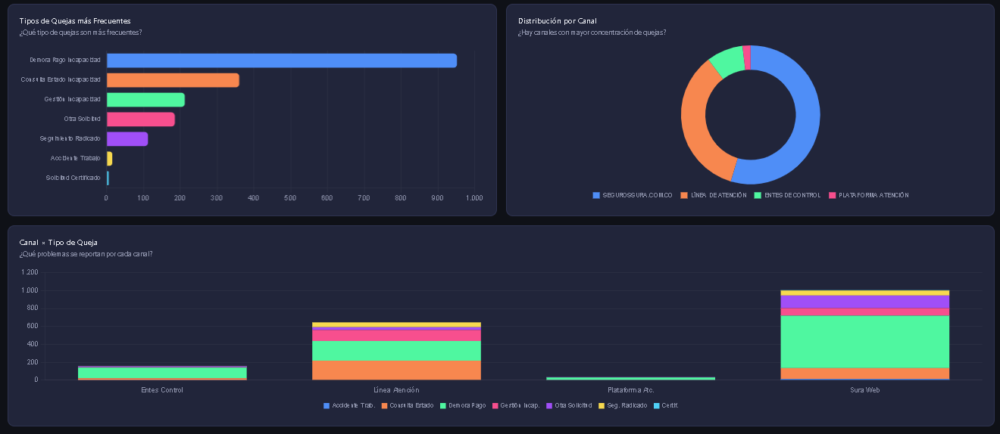
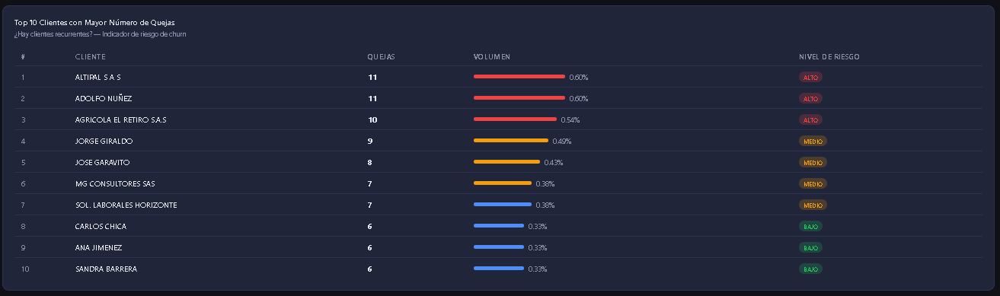
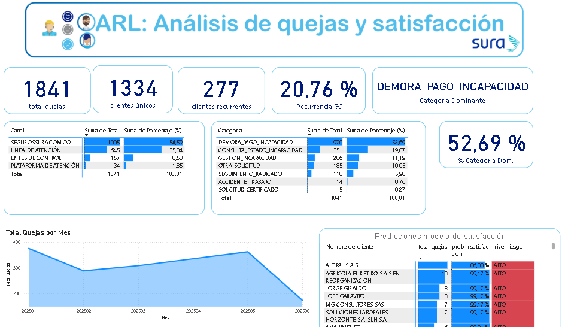
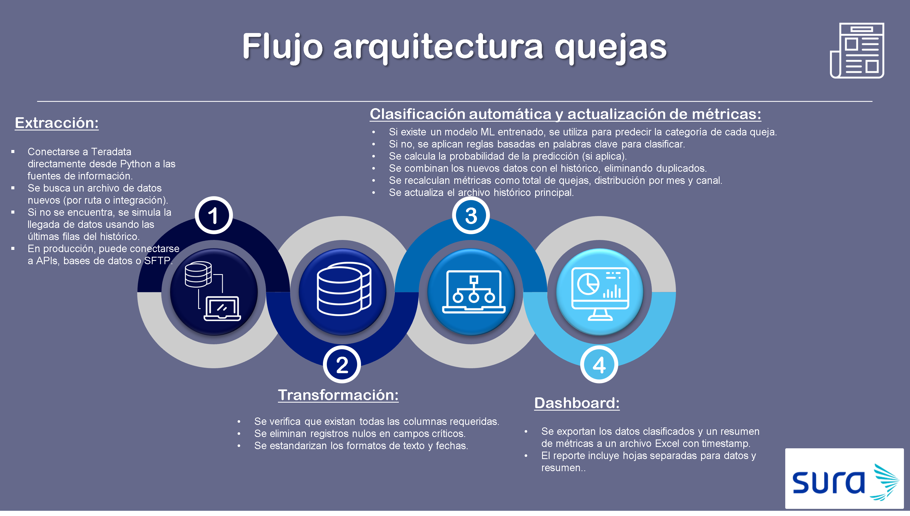

# **Prueba Técnica - Analista de Analítica Sura**
### Analista analítica:

* Daniel Felipe Pérez Grajales . dfperezg@unal.edu.co<br>

> Empresa de pagos a prestadores de servicios de salud por accidentes laborales

---

## Estructura del Repositorio

```
quejas_repo/
│
├── data/
│   └── BD_Quejas_Analitica.xlsx        # Base de datos original (1,841 registros)
│
├── notebooks/
│   |── 01_EDA_y_Patrones.ipynb         #   Exploración, patrones y causa raíz 
|   |__ 02_identificacion_clasificador.ipynb # reglas de clasificación topicos
|   |__ 03_cosntruccion_modelo_predicto.ipynb # modelo predictivo de insatisfacción
(Punto a)
│
├── src/
│   ├── clasificador.py                  # Modelo NLP de clasificación de quejas
│   ├── metricas.py                      # Cálculo de métricas clave (Punto b)
│   └── predictor_insatisfaccion.py      # Modelo predictivo de insatisfacción (Punto e)
│
├── dashboard/
│   |── dashboard_quejas.
|   |__ Dashboard_quejas_sura.pbix
|
html            # Dashboard interactivo (Punto c)
│
├── pipeline/
│   ├── pipeline_semanal.py              # Flujo automatizado semanal (Punto d)
│   └── config.yaml                      # Configuración del pipeline
│
├── docs/
│   └── metodologia_herramienta.md       # Metodologías para nueva herramienta (Punto e)
│
├── outputs/
│   └── metricas_resumen.xlsx            # Métricas calculadas exportadas
│
└── README.md                            # Este archivo
```

---

## Preguntas Resueltas

| Punto | Descripción | Archivo |
|-------|-------------|---------|
| **a** | Patrones y causas raíz de insatisfacción | `notebooks/01_EDA_y_Patrones.ipynb` |
| **b** | Métricas clave | `src/metricas.py` + `outputs/metricas_resumen.xlsx` |
| **c** | Dashboard de decisiones | `dashboard/dashboard_quejas.html` |
| **d** | Flujo automatizado semanal | `pipeline/pipeline_semanal.py` |
| **e** | Metodología nueva herramienta tecnológica | `docs/metodologia_herramienta.md` |

---

## Resumen de Hallazgos

### Punto A:

### Datos
- **1,841 quejas** registradas entre enero y junio 2025
- **4 canales** de comunicación identificados
- **100%** de registros clasificados como tipo QUEJA

### Patrones Principales
1. **Demora en pago de incapacidades** — causa raíz #1 (>57% de quejas)
2. **Falta de información sobre estado** — causa raíz #2 (39% de quejas)
3. **Canal web (segurossura.com.co)** lidera con 54.6% de las quejas
4. **Pico en enero 2025** (375 quejas) con tendencia al descenso

### Conclusiones — Causas Raíz Identificadas

| # | Causa Raíz | Evidencia | % del Total |
|---|-----------|-----------|-------------|
| 1 | **Demora en pago de incapacidades** | 952 quejas explícitas de mora/cobro | 51.7% |
| 2 | **Falta de información sobre estado** | 360 consultas de estado | 19.6% |
| 3 | **Gestión ineficiente de incapacidades** | 212 quejas sin claridad de causa | 11.5% |
| 4 | **Canal web sin respuesta oportuna** | 1005/1841 quejas por web | 54.6% |
| 5 | **Clientes multi-quejosos sin resolución** | Top 10 clientes acumulan 81 quejas | 4.4% |

### Recomendaciones
1. **Automatizar el proceso de pago de incapacidades** — mayor impacto potencial
2. **Implementar portal de seguimiento en tiempo real** — reduce consultas de estado
3. **Crear alertas proactivas** — notificar al cliente antes de que tenga que preguntar
4. **Priorizar atención al canal web** — concentra el 54.6% del volumen
5. **Programa de gestión de clientes críticos** — intervención para top 20 clientes

### Dashboard punto B y C prototipo

#### Metricas generales



#### Comportamiento canales



#### Modelo predictivo



#### Dashboard general PWBI



### D. Flujo producción solución analitica:

se encuentra en `pipeline/pipeline_semanal.py` 

documentación: `docs/flujo_automatizado_semanal.md`



### E. Metodología nueva herramienta tecnológica 

Se encuentra en :  `docs/metodologia_herramienta.md`


---

### Instalación y Uso

```bash
# Clonar repositorio
git clone https://github.com/Dfperezgdatascientist/Prueba_tecnica_Sura_analista_analitica_sura.git
cd Prueba_tecnica_Sura_analista_analitica_sura.git

# Instalar dependencias
pip install -r requirements.txt

# Ejecutar análisis completo
python src/metricas.py

# Ejecutar pipeline semanal
python pipeline/pipeline_semanal.py

# Abrir dashboard
start dashboard/dashboard_quejas.html
```

### Herramientas Utilizadas
| Tarea | Herramienta |
|-------|-------------|
| EDA y análisis | Python (pandas, matplotlib, seaborn) |
| NLP / Clasificación | scikit-learn, TF-IDF |
| Dashboard | HTML + Chart.js + Plotly |
| Pipeline | Python + schedule / Apache Airflow |
| Predicción | Random Forest / Logistic Regression |
| Documentación | Markdown |


---

## Supuestos

1. El campo `Mes apertura del caso` representa año+mes en formato YYYYMM
2. Todas las quejas son de tipo "QUEJA" — se infiere que la empresa aún no clasifica subtipos
3. Los nombres de clientes pueden ser personas naturales o empresas (jurídicas)
4. Los datos cubren enero–junio 2025 (6 meses de análisis)
5. Para el modelo predictivo se usó frecuencia de quejas por cliente como proxy de insatisfacción
